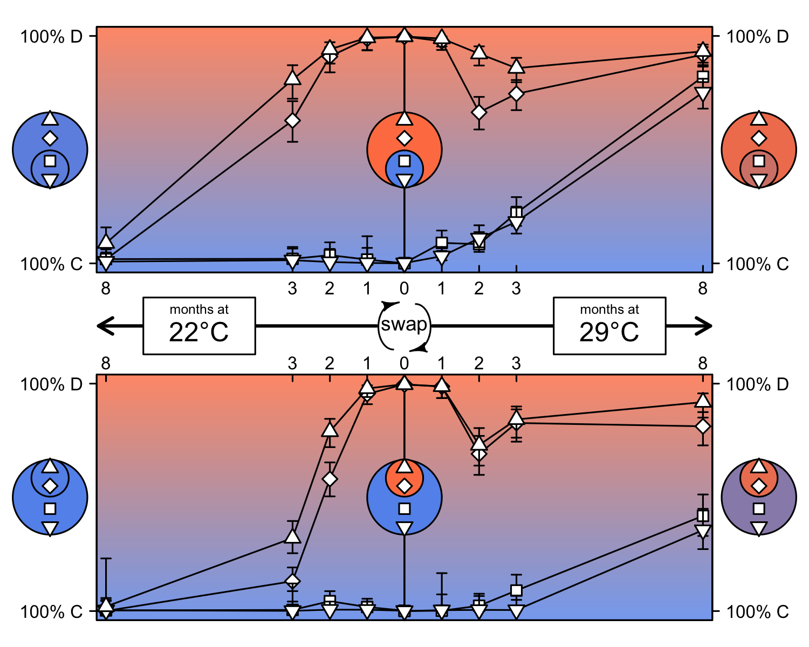
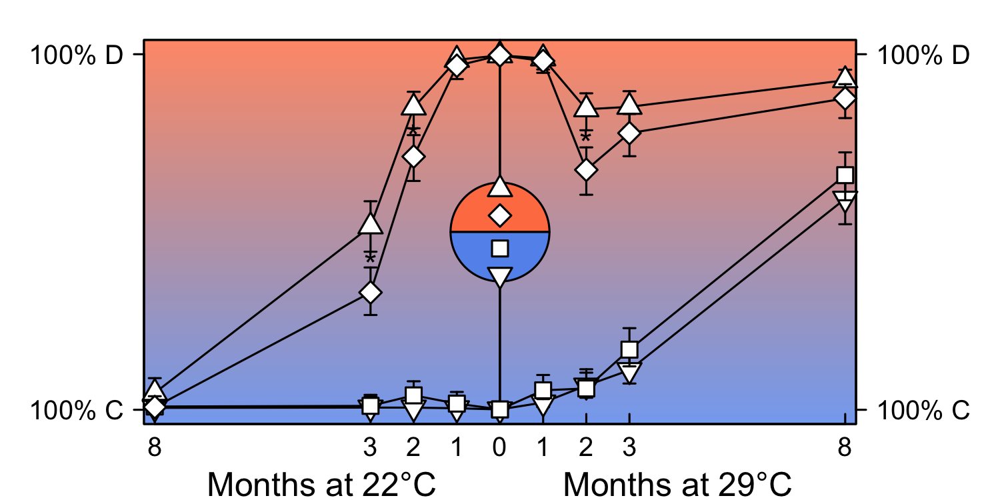

```{r setup, include=FALSE}
knitr::opts_chunk$set(echo = TRUE, cache=FALSE, warning=FALSE, message=FALSE)
knitr::opts_knit$set(root.dir = normalizePath(".."))
```

```{r tidy_data, include = FALSE, eval = FALSE}
# This chunk reads the data in from the raw excel file, and tidies for downstream analysis. The tidy dataset is saved as an .RData object, so this code does not need to be run if data/mcswap.RData already exists.

library(tidyverse)
library(readxl)

# Read in sample metadata for all swaps
sample_data <- read_excel("data/McSwapData.xlsx", sheet="ALLswaps")

sample_data_clean <- bind_rows(
  sample_data %>% 
    select(1, 2, 3, 6) %>% 
    rename(bcore=M.cavernosa, lcore=Core, prev=Treatment, temp=Temp),
  sample_data %>% 
    select(7, 8, 9, 12) %>% 
    rename(bcore=M.cavernosa__1, lcore=Core__2, prev=Treatment__1, temp=Temp__1),
  sample_data %>% 
    select(13, 14, 15, 18) %>% 
    rename(bcore=M.cavernosa__2, lcore=Core__4, prev=Treatment__2, temp=Temp__2)
)

# Sort by big core / little core pairs
bcore.ord <- order(sample_data_clean$bcore)
lcore.ord <- order(sample_data_clean$lcore)
ord <- pmin(bcore.ord * 2 - 1, lcore.ord * 2)

sample_data_clean <- sample_data_clean %>% 
  arrange(ord) %>%
  mutate(swap=as.numeric(rownames(.))) %>%  # assign 'swap' number for each swap
  select(swap, bcore, lcore, prev, temp)

sample_data_clean

# Read in symbiont data - initial time point (t0)
# Each core was sampled once (no mini-transect performed at t0)
sym_t0 <- read_excel("data/McSwapData.xlsx", sheet="Int-data", skip=1)

sym_t0_clean <- sym_t0 %>%
  select(3,7,8) %>%
  rename(core=SAMPLE, D=D__1, C=C__1) %>%
  separate(core, into=c("core", "time"), sep="_") %>%
  mutate(time=as.numeric(gsub("INT", 0, time))) %>%
  select(time, core, D, C)

sym_t0_clean

# Create new data frame for hypothetical mini-transect at time 0, assuming that single
# sample from each core right before swap is representative of the entire core
sym_t0_clean_expand <- 
  # Create expanded grid for each swap with four sampling positions (mini-transect)
  crossing(swap=sample_data_clean$swap, pos=c("1","2","3","4")) %>%
  # Get core IDs for each swap from sample metadata
  inner_join(sample_data_clean) %>%  
  # For positions 1 and 2, keep core = big core ID, for 3 and 4, core = little core ID
  mutate(core=ifelse(pos %in% c(1,2), bcore, lcore)) %>%
  select(swap, pos, core, temp) %>%
  # Get sym data for each core from t0 sym data
  inner_join(sym_t0_clean) %>%
  select(time, swap, pos, core, temp, D, C)

sym_t0_clean_expand


# Read in symbiont data - t1 (1 month after swap)
# SAMPLE column = bcore.ID_pos (i.e., bcore.ID was used to indicate swap ID during data collection) 
# This means bcore.ID_3 and bcore.ID_4 are actually samples of the little core in the swap
sym_t1 <- read_excel("data/McSwapData.xlsx", sheet="t1-data", skip=1)

sym_t1_clean <- sym_t1 %>%
  select(4, 8, 9) %>%
  rename(sample=SAMPLE, D=D__1, C=C__1) %>%
  separate(sample, into=c("bcore", "pos"), sep="_") %>%
  # Merge with sample metadata
  inner_join(sample_data_clean) %>%
  # For pos 1,2 get big core ID, for pos 3,4, get little core ID
  mutate(core=ifelse(pos %in% c(1,2), bcore, lcore), time=1) %>%
  select(time, swap, pos, core, temp, D, C)

sym_t1_clean

# Read in symbiont data - t2 (2 months after swap)
sym_t2 <- read_excel("data/McSwapData.xlsx", sheet="t2-data", skip=1)

sym_t2_clean <- sym_t2 %>%
  select(4, 8, 9) %>%
  rename(sample=SAMPLE, D=D__1, C=C__1) %>%
  separate(sample, into=c("bcore", "pos"), sep="_") %>%
  # Merge with sample metadata
  inner_join(sample_data_clean) %>%
  # For pos 1,2 get big core ID, for pos 3,4, get little core ID
  mutate(core=ifelse(pos %in% c(1,2), bcore, lcore), time=2) %>%
  select(time, swap, pos, core, temp, D, C)

sym_t2_clean

# Read in symbiont data - t3 (3 months after swap)
sym_t3 <- read_excel("data/McSwapData.xlsx", sheet="t3-data", skip=1)

sym_t3_clean <- sym_t3 %>%
  select(4, 8, 9) %>%
  rename(sample=SAMPLE, D=D__1, C=C__1) %>%
  separate(sample, into=c("bcore", "pos"), sep="_") %>%
  # Merge with sample metadata
  inner_join(sample_data_clean) %>%
  # For pos 1,2 get big core ID, for pos 3,4, get little core ID
  mutate(core=ifelse(pos %in% c(1,2), bcore, lcore), time=3) %>%
  select(time, swap, pos, core, temp, D, C)

sym_t3_clean

# Read in symbiont data - t8 (8 months after swap)
sym_t8 <- read_excel("data/McSwapData.xlsx", sheet="End-data", skip=1)

sym_t8_clean <- sym_t8 %>%
  select(3, 7, 8) %>%
  rename(sample=SAMPLE, D=D__1, C=C__1) %>%
  separate(sample, into=c("bcore", "pos"), sep="_") %>%
  # Merge with sample metadata
  inner_join(sample_data_clean) %>%
  # For pos 1,2 get big core ID, for pos 3,4, get little core ID
  mutate(core=ifelse(pos %in% c(1,2), bcore, lcore), time=8) %>%
  select(time, swap, pos, core, temp, D, C)

sym_t8_clean


# Combine data from all time points
mcswap <- bind_rows(sym_t0_clean_expand, 
                     sym_t1_clean, 
                     sym_t2_clean, 
                     sym_t3_clean, 
                     sym_t8_clean)

save(mcswap, file="data/mcswap.RData")
```

# Load data and libraries
```{r load}
# Load libraries
library(tidyverse)
library(lsmeans)
library(lattice)
library(gamm4)
library(plotrix)
library(diagram)

# Load tidy data
load("data/mcswap.RData")
```

# Data wrangling
```{r filterCD}
# Change zeros to lowest detected value and recalculate propD
Dlim <- min(mcswap$D[mcswap$D > 0])
Clim <- min(mcswap$C[mcswap$C > 0])
mcswap$D[mcswap$D==0] <- Dlim
mcswap$C[mcswap$C==0] <- Clim

# Calculate proportion D and assign dominant symbiont
mcswap$propD <- with(mcswap, D / (D + C))
mcswap$dom <- with(mcswap, ifelse(propD > 0.5, "D", "C"))

# Get which swaps were CD swaps
CD <- mcswap %>%
  filter(time==0) %>%  # at time 0...
  group_by(swap) %>%  # look at each swap...
  filter("C" %in% dom && "D" %in% dom) %>%  # if C-dom and D-dom exist...
  summarise()

# Count number of CD swaps
nrow(CD)

# Subset data for CD swaps only
CDswap <- mcswap %>% inner_join(CD)

# Add grouping variable for (bigcoredom.temp): C22, C29, D22, D29
groups <- CDswap %>%
  filter(time==0 & pos==1) %>%  # at time 0, look at big core (pos=1)
  group_by(bcore.dom=dom, temp) %>%
  do(unique(.[,"swap"])) %>%
  mutate(group=paste0(bcore.dom, temp))
CDswap <- bind_cols(CDswap, groups[match(CDswap$swap, groups$swap), "group"])

```

# Visualize data
```{r}
# Visualize all data
xyplot(propD ~ time | group, groups=pos, data=CDswap)

# Model each genotype individually
# Fit glm (quasibinomial) with time as a factor and host genotype as factor
CDswap$geno <- substr(CDswap$core, 1, 1)
mod <- glm(propD ~ group * pos * factor(time) * geno, data=CDswap, family="quasibinomial")
# Get fitted responses for each group
lsm <- lsmeans(mod, specs=c("group", "pos", "time", "geno"), type="response")
xyplot(prob ~ time | group + geno, groups=pos, data=data.frame(summary(lsm)), type="o")
```

# Fit generalized linear model
```{r fit_models}
# Fit glm (quasibinomial) across all genotypes
mod <- glm(propD ~ group * pos * factor(time), data=CDswap, family="quasibinomial")
# Get fitted responses for each group
lsm <- lsmeans(mod, specs=c("group", "pos", "time"), type="response")
xyplot(prob ~ time | group, groups=pos, data=data.frame(summary(lsm)), type="o")
df <- data.frame(summary(lsm, level=0.84))
```

# Plot results
```{r}
# PLOT
par(mfcol=c(2,2), mar=c(3,3,1.5,1), mgp=c(1.5,0.3,0), xpd=T, tcl=-0.3)

D22 <- subset(df, group=="D22")
plot(NA, xlim=c(0,8), ylim=c(0,1), data=D22, yaxt="n",
     xlab="Months", ylab="Proportion clade D")
axis(side = 2, at=c(0,1))
mtext(side=3, "a) 22°C, large D-core", adj=0, font=4)
gradient.rect(par("usr")[1], par("usr")[3], par("usr")[2], par("usr")[4],
              col=smoothColors("cornflowerblue", 100, "coral"), gradient="y")
for (pos in split(D22, D22$pos)) with(pos, {
  arrows(time[-1], asymp.LCL[-1], time[-1], asymp.UCL[-1], col="black", code=3, angle=90, length=0.03)
  points(prob ~ time, col="black", type="o", pch=c(24,23,22,25)[pos], bg="white", cex=1.2)
})
x <- 0; y <- 0.5
draw.circle(x, y, 1, col="coral"); draw.circle(x, y-0.085, 0.5, col="cornflowerblue")
points(rep(x,4), c(y-0.13, y-0.05, y+0.05, y+0.13), pch=c(25,22,23,24), bg="white", cex=1.2)

C22 <- subset(df, group=="C22")
plot(NA, xlim=c(0,8), ylim=c(0,1), data=C22, yaxt="n",
     xlab="Months", ylab="Proportion clade D")
axis(side = 2, at=c(0,1))
mtext(side=3, "c) 22°C, small D-core", adj=0, font=4)
gradient.rect(par("usr")[1], par("usr")[3], par("usr")[2], par("usr")[4],
              col=smoothColors("cornflowerblue", 100, "coral"), gradient="y")
for (pos in split(C22, C22$pos)) with(pos, {
  arrows(time[-1], asymp.LCL[-1], time[-1], asymp.UCL[-1], col="black", code=3, angle=90, length=0.03)
  points(prob ~ time, col="black", type="o", pch=rev(c(24,23,22,25))[pos], bg="white", cex=1.2)
})
draw.circle(x, y, 1, col="cornflowerblue"); draw.circle(x, y+0.085, 0.5, col="coral")
points(rep(x,4), c(y-0.13, y-0.05, y+0.05, y+0.13), pch=c(25,22,23,24), bg="white", cex=1.2)

D29 <- subset(df, group=="D29")
plot(NA, xlim=c(0,8), ylim=c(0,1), data=D29, yaxt="n",
     xlab="Months", ylab="Proportion clade D")
axis(side = 2, at=c(0,1))
mtext(side=3, "c) 29°C, large D-core", adj=0, font=4)
gradient.rect(par("usr")[1], par("usr")[3], par("usr")[2], par("usr")[4],
              col=smoothColors("cornflowerblue", 100, "coral"), gradient="y")
for (pos in split(D29, D29$pos)) with(pos, {
  arrows(time[-1], asymp.LCL[-1], time[-1], asymp.UCL[-1], col="black", code=3, angle=90, length=0.03)
  points(prob ~ time, col="black", type="o", pch=c(24,23,22,25)[pos], bg="white", cex=1.2)
})
draw.circle(x, y, 1, col="coral"); draw.circle(x, y-0.085, 0.5, col="cornflowerblue")
points(rep(x,4), c(y-0.13, y-0.05, y+0.05, y+0.13), pch=c(25,22,23,24), bg="white", cex=1.2)

C29 <- subset(df, group=="C29")
plot(NA, xlim=c(0,8), ylim=c(0,1), data=C29, yaxt="n",
     xlab="Months", ylab="Proportion clade D")
axis(side = 2, at=c(0,1))
mtext(side=3, "d) 29°C, small D-core", adj=0, font=4)
gradient.rect(par("usr")[1], par("usr")[3], par("usr")[2], par("usr")[4],
              col=smoothColors("cornflowerblue", 100, "coral"), gradient="y")
for (pos in split(C29, C29$pos)) with(pos, {
  arrows(time[-1], asymp.LCL[-1], time[-1], asymp.UCL[-1], col="black", code=3, angle=90, length=0.03)
  points(prob ~ time, col="black", type="o", pch=rev(c(24,23,22,25))[pos], bg="white", cex=1.2)
})
draw.circle(x, y, 1, col="cornflowerblue"); draw.circle(x, y+0.085, 0.5, col="coral")
points(rep(x,4), c(y-0.13, y-0.05, y+0.05, y+0.13), pch=c(25,22,23,24), bg="white", cex=1.2)
```

# Create figure with reversed time axis
```{r create_fig1}
# Create png output device
png("figures/fig1.png", width=5, height=4, units="in", res=300)

# Set global parameters
par(mfcol=c(2,2), mgp=c(1.5,0,0), xpd=NA, tcl=0.25, cex.axis=0.8)
# Create color palette for background and core circles
btor <- smoothColors("cornflowerblue", 100, "coral")

## Plot upper-left panel (D22) -----
D22 <- subset(df, group=="D22")  # Subset data
par(mar=c(1.9,3.6,1,0))  # Set panel margins
# Create blank plot and axes
plot(NA, xlim=c(-8.25,0), ylim=c(0,1), yaxt="n", xaxt="n", xaxs="i", xlab="", ylab="")
gradient.rect(par("usr")[1], par("usr")[3], par("usr")[2], par("usr")[4], col=alpha(btor, 0.8), gradient="y")
axis(side = 1, at=c(-8, -3, -2, -1, 0), labels = c(8, 3, 2, 1, ""), line=0)
axis(side = 2, at=c(0, 1), labels=c("100% C", "100% D"), las=1, mgp=c(1.5, 0.5, 0), tcl=-0.25)
# Plot data and error bars
for (pos in split(D22, D22$pos)[c(2,3,1,4)]) with(pos, {
  arrows(-1*time[-1], asymp.LCL[-1], -1*time[-1], asymp.UCL[-1], col="black", 
         code=3, angle=90, length=0.03)
  points(-1*time, prob, col="black", type="o", pch=c(24,23,22,25)[pos], bg="white", cex=1.2)
})
# Draw time arrow below plot
arrows(-0.75, -0.275, -8.2, -0.275, length=0.1, lwd=2)
rect(-4, -0.15, -7, -0.4, col="white", lwd=1)
text(-5.5, -0.2, "months at", cex=0.6)
text(-5.5, -0.3, "22°C", cex=1.2)

# arrows(-0.75, -0.275, -8.2, -0.275, length=0.1, lwd=2)
# legend(x=c(-6.5, -1.5), y=c(-0.2, -0.35), "Months at 22°C", box.col = "black", bg = "white", 
#        adj = c(0.15, -0.1))
# Draw core circle
x <- -9.5; y <- 0.5
draw.circle(x, y, 1, col=btor[round(with(D22, D22[pos==1 & time==8, "prob"])*100, 2)])
draw.circle(x, y-0.085, 0.5, col=btor[round(with(D22, D22[pos==4 & time==8, "prob"])*100, 2)])
points(rep(x,4), c(y-0.13, y-0.05, y+0.05, y+0.13), pch=c(25,22,23,24), bg="white", cex=1.2)

## Plot lower-left panel (C22) -----
C22 <- subset(df, group=="C22")  # Subset data
par(mar=c(1,3.6,1.9,0))  # Set panel margins
# Create blank plot and axes
plot(NA, xlim=c(-8.25,0), ylim=c(0,1), yaxt="n", xaxt="n", xaxs="i", xlab="", ylab="")
gradient.rect(par("usr")[1], par("usr")[3], par("usr")[2], par("usr")[4], col=alpha(btor, 0.8), gradient="y")
axis(side = 3, at=c(-8, -3, -2, -1, 0), labels = c(8, 3, 2, 1, ""), line=0)
axis(side = 2, at=c(0, 1), labels=c("100% C", "100% D"), las=1, mgp=c(1.5, 0.5, 0), tcl=-0.25)
# Plot data and error bars
for (pos in split(C22, C22$pos)[c(2,3,1,4)]) with(pos, {
  arrows(-1*time[-1], asymp.LCL[-1], -1*time[-1], asymp.UCL[-1], col="black", 
         code=3, angle=90, length=0.03)
  points(-1*time, prob, col="black", type="o", pch=rev(c(24,23,22,25))[pos], bg="white", cex=1.2)
})
# Draw core circle
x <- -9.5; y <- 0.5
draw.circle(x, y, 1, col=btor[max(1,round(with(C22, C22[pos==1 & time==8, "prob"])*100, 2))])
draw.circle(x, y+0.085, 0.5, col=btor[round(with(C22, C22[pos==4 & time==8, "prob"])*100, 2)])
points(rep(x,4), c(y-0.13, y-0.05, y+0.05, y+0.13), pch=c(25,22,23,24), bg="white", cex=1.2)

## Plot upper-right panel (D29) -----
D29 <- subset(df, group=="D29")  # Subset data
par(mar=c(1.9,0,1,3.6))  # Set panel margins
# Create blank plot and axes
plot(NA, xlim=c(0,8.25), ylim=c(0,1), yaxt="n", xaxs="i", xaxt="n", xlab="", ylab="")
gradient.rect(par("usr")[1], par("usr")[3], par("usr")[2], par("usr")[4], col=alpha(btor, 0.8), gradient="y")
axis(side = 1, at=c(0, 1, 2, 3, 8))
axis(side = 4, at=c(0, 1), labels=c("100% C", "100% D"), las=1, mgp=c(1.5, 0.5, 0), tcl=-0.25)
# Plot data and error bars
for (pos in split(D29, D29$pos)[c(2,3,1,4)]) with(pos, {
  arrows(time[-1], asymp.LCL[-1], time[-1], asymp.UCL[-1], col="black", 
         code=3, angle=90, length=0.03)
  points(prob ~ time, col="black", type="o", pch=c(24,23,22,25)[pos], bg="white", cex=1.2)
})
# Draw time arrow below plot
arrows(0.75, -0.275, 8.2, -0.275, length=0.1, lwd=2)
rect(4, -0.15, 7, -0.4, col="white")
text(5.5, -0.2, "months at", cex=0.6)
text(5.5, -0.3, "29°C", cex=1.2)

# legend(x=c(1.5, 6.5), y=c(-0.2, -0.35), "Months at 29°C", box.col = "black", bg = "white", 
#        adj = c(0.15, -0.1))
# Draw core circles
x <- 0; y <- 0.5
draw.circle(x, y, 1, col="coral"); draw.circle(x, y-0.085, 0.5, col="cornflowerblue")
points(rep(x,4), c(y-0.13, y-0.05, y+0.05, y+0.13), pch=c(25,22,23,24), bg="white", cex=1.2)
x <- 9.5; y <- 0.5
draw.circle(x, y, 1, col=btor[round(with(D29, D29[pos==1 & time==8, "prob"])*100, 2)])
draw.circle(x, y-0.085, 0.5, col=btor[round(with(D29, D29[pos==4 & time==8, "prob"])*100, 2)])
points(rep(x,4), c(y-0.13, y-0.05, y+0.05, y+0.13), pch=c(25,22,23,24), bg="white", cex=1.2)

## Plot lower-right panel (C29)
C29 <- subset(df, group=="C29")  # Subset data
par(mar=c(1,0,1.9,3.6))  # Set panel margins
# Create blank plot and axes
plot(NA, xlim=c(0,8.25), ylim=c(0,1), yaxt="n", xaxs="i", xaxt="n", xlab="", ylab="")
gradient.rect(par("usr")[1], par("usr")[3], par("usr")[2], par("usr")[4], col=alpha(btor, 0.8), gradient="y")
axis(side = 3, at=c(0, 1, 2, 3, 8))
axis(side = 4, at=c(0, 1), labels=c("100% C", "100% D"), las=1, mgp=c(1.5, 0.5, 0), tcl=-0.25)
# Plot data and error bars
for (pos in split(C29, C29$pos)[c(2,3,1,4)]) with(pos, {
  arrows(time[-1], asymp.LCL[-1], time[-1], asymp.UCL[-1], col="black", 
         code=3, angle=90, length=0.03)
  points(prob ~ time, col="black", type="o", pch=rev(c(24,23,22,25))[pos], bg="white", cex=1.2)
})
# Draw core circles
x <- 0; y <- 0.5
draw.circle(x, y, 1, col="cornflowerblue"); draw.circle(x, y+0.085, 0.5, col="coral")
points(rep(x,4), c(y-0.13, y-0.05, y+0.05, y+0.13), pch=c(25,22,23,24), bg="white", cex=1.2)
x <- 9.5; y <- 0.5
draw.circle(x, y, 1, col=btor[round(with(C29, C29[pos==1 & time==8, "prob"])*100, 2)]) 
draw.circle(x, y+0.085, 0.5, col=btor[round(with(C29, C29[pos==4 & time==8, "prob"])*100, 2)])
points(rep(x,4), c(y-0.13, y-0.05, y+0.05, y+0.13), pch=c(25,22,23,24), bg="white", cex=1.2)

# Draw swap icon at center
curvedarrow(from = c(-0.3, 1.15), to = c(-0.3, 1.35),
           lty=1, curve=-2, arr.pos=0.95, arr.type="curved", arr.length=0.2, lwd=1)
curvedarrow(from = c(0.3, 1.35), to = c(0.3, 1.15),
           lty=1, curve=-2, arr.pos=0.95, arr.type="curved", arr.length=0.2, lwd=1)
text(x = 0, y = 1.25, labels = "swap", cex=0.9)

dev.off()

```



# Supplemental analysis and figures

```{r}
# merge little/big
CDswap <- CDswap %>% 
  mutate(
  pos2=case_when(
    (grepl("C", .$group) & .$pos=="1") | (grepl("D", .$group) & .$pos=="4") ~ "C.distal",
    (grepl("C", .$group) & .$pos=="2") | (grepl("D", .$group) & .$pos=="3") ~ "C.proximal",
    (grepl("C", .$group) & .$pos=="3") | (grepl("D", .$group) & .$pos=="2") ~ "D.proximal",
    (grepl("C", .$group) & .$pos=="4") | (grepl("D", .$group) & .$pos=="1") ~ "D.distal"
))

# Fit glm (quasibinomial) with time as a factor and random pos/core effect
mod2 <- glm(propD ~ temp * pos2 * factor(time), data=CDswap, family="quasibinomial")

# Get fitted responses for each temp
lsm2 <- lsmeans(mod2, specs=c("temp", "pos2", "time"), type="response")
xyplot(prob ~ time | temp, groups=pos2, data=data.frame(summary(lsm2)), type="o")
df2 <- data.frame(summary(lsm2, level=0.84))

# Run pairwise stats -- are proximal vs. distal different for each temp/dom/time?
pairtests <- pairs(lsm2, by=c("temp", "time"))
pairtests2 <- rbind(pairtests)[sort(c(1 + 0:9 * 6, 6 + 0:9 * 6)),]
subset(summary(pairtests2, adjust="none"), p.value < 0.05)


# Create png output device
png("figures/figS1.png", width=5, height=2.5, units="in", res=300)
## Plot left panel (22) -----
temp22 <- subset(df2, temp=="22")  # Subset data
par(mfrow=c(1,2), mar=c(1.9,3.6,1,0), mgp=c(1.5,0,0), xpd=NA, tcl=0.25, cex.axis=0.8)
# Create blank plot and axes
plot(NA, xlim=c(-8.25,0), ylim=c(0,1), yaxt="n", xaxt="n", xaxs="i", xlab="", ylab="")
gradient.rect(par("usr")[1], par("usr")[3], par("usr")[2], par("usr")[4], col=alpha(btor, 0.8), gradient="y")
axis(side = 1, at=c(-8, -3, -2, -1, 0), labels = c(8, 3, 2, 1, ""), line=0)
mtext(side = 1, "Months at 22°C", line=1)
axis(side = 2, at=c(0, 1), labels=c("100% C", "100% D"), las=1, mgp=c(1.5, 0.5, 0), tcl=-0.25)
# Plot data and error bars
for (pos2 in split(temp22, temp22$pos2)) with(pos2, {
  arrows(-1*time[-1], asymp.LCL[-1], -1*time[-1], asymp.UCL[-1], col="black", 
         code=3, angle=90, length=0.03)
  points(-1*time, prob, col="black", type="o", pch=c(25,22,24,23)[pos2], bg="white", cex=1.2)
})
points(-2, 0.79, pch="*", cex=1, font=1)
points(-3, 0.43, pch="*", cex=1, font=1)

## Plot right panel (29)
temp29 <- subset(df2, temp=="29")  # Subset data
par(mar=c(1.9,0,1,3.6))  # Set panel margins
# Create blank plot and axes
plot(NA, xlim=c(0,8.25), ylim=c(0,1), yaxt="n", xaxs="i", xaxt="n", xlab="", ylab="")
gradient.rect(par("usr")[1], par("usr")[3], par("usr")[2], par("usr")[4], col=alpha(btor, 0.8), gradient="y")
axis(side = 1, at=c(0, 1, 2, 3, 8))
mtext(side = 1, "Months at 29°C", line=1)
axis(side = 4, at=c(0, 1), labels=c("100% C", "100% D"), las=1, mgp=c(1.5, 0.5, 0), tcl=-0.25)
# Plot data and error bars
for (pos2 in split(temp29, temp29$pos2)) with(pos2, {
  arrows(time[-1], asymp.LCL[-1], time[-1], asymp.UCL[-1], col="black", 
         code=3, angle=90, length=0.03)
  points(prob ~ time, col="black", type="o", pch=c(25,22,24,23)[pos2], bg="white", cex=1.2)
})
points(2, 0.77, pch="*", cex=1, font=1)

# Draw circle in the center
upper.half.circle <- function(x,y,r,nsteps=100,...){  
  rs <- seq(0,pi,len=nsteps) 
  xc <- x+r*cos(rs) 
  yc <- y+r*sin(rs) 
  polygon(xc,yc,...) 
} 

lower.half.circle <- function(x,y,r,nsteps=100,...){ 
  rs <- seq(0,pi,len=nsteps) 
  xc <- x-r*cos(rs) 
  yc <- y-r*sin(rs) 
  polygon(xc,yc,...) 
} 

par(new=T)
plot(NA, asp=1, xlim=c(0,1), ylim=c(0,1), axes=F, xlab="", ylab="", xpd=NA)
upper.half.circle(-0.04,0.5,0.15,nsteps=1000,col='coral')
lower.half.circle(-0.04,0.5,0.15,nsteps=1000,col='cornflowerblue')
points(rep(-0.04,4), c(0.5-0.13, 0.5-0.05, 0.5+0.05, 0.5+0.13), pch=c(25,22,23,24), bg="white", cex=1.2)
dev.off()
```



